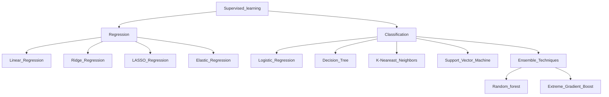

## Supervised learning

## About Supervised learning

Supervised Machine Learning is divided into two parts based upon their output:

## Supervised learning algorithms

- Neural networks:

- Naive bayes: 

- Linear regression:

- Logistic regression: 

- Support vector machines (SVM):

- K-nearest neighbor: 

- Random forest: 

## Supervised learning Use Cases

- Spam detection: 
- Customer sentiment analysis:
- Predictive analytics:
- Image- and object-recognition: 

## References

- [Documentation](https://docs/latest/index.html)

- [Supervised learning tutorial](https://youtu.be/)

## Author
<a href="https://www.linkedin.com/in/esumit/">Sumit Mitra</a> has a Masters Degree in Electonics Engineering, he is experienced product manager with focused on leveraging machine learning, Artificial Intelligence to Design Thinking and developing new product features and integration. Sumit has been working for Rakuten since 2021.